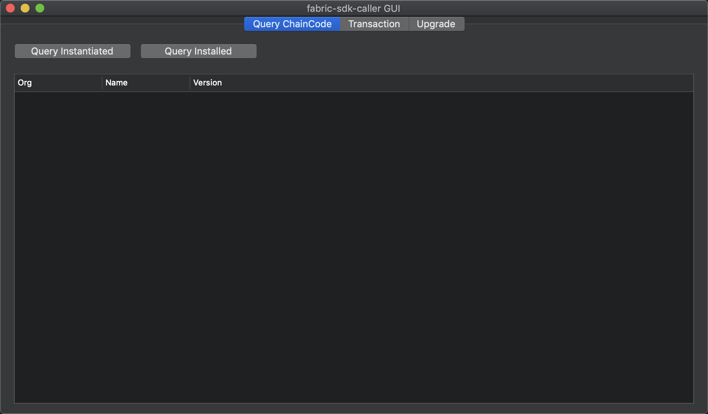
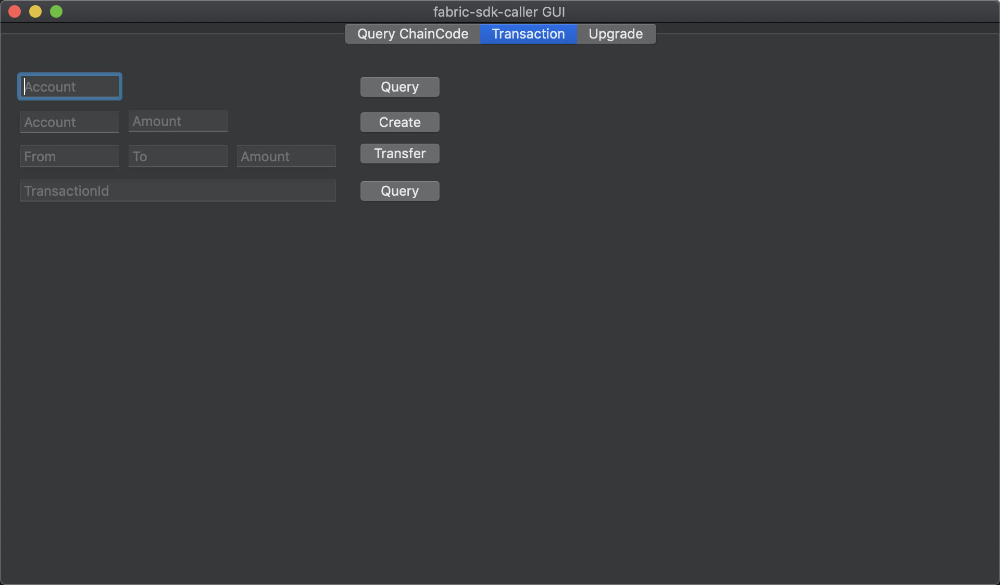
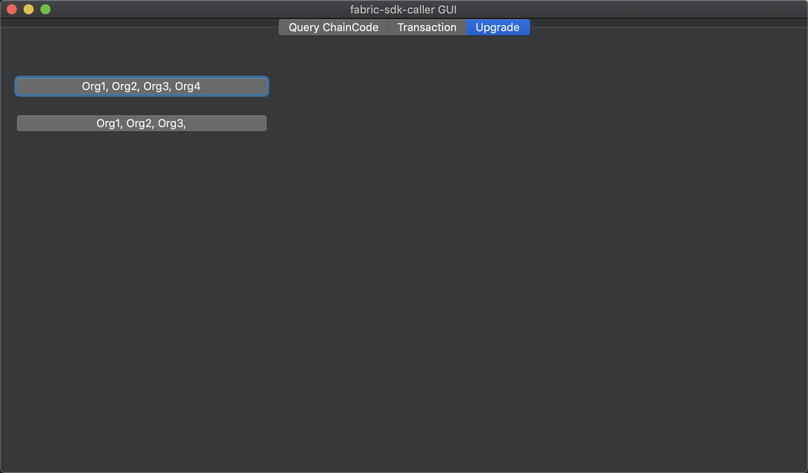

= fabric-sdk-caller

一个使用 Swift 开发的 UI 客户端。配合另一个项目 fabric-sdk-demo 做演示之用。 两者之间通过 gRPC 进行通信。

== 完成的功能

* 查找已安装的 chaincode
* 查找已初始化的 chaincode
* 根据 chaincode 创建账户
* 根据 chaincode 查看账户余额
* 根据 chaincode 转账
* 更新 chaincode 的背书策略

== 界面截图

